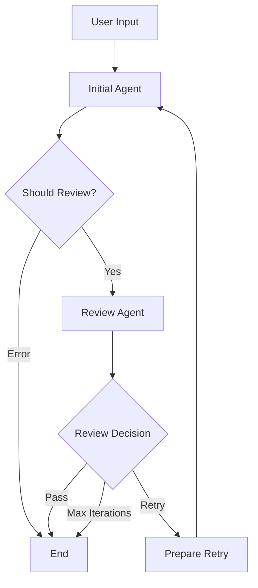

# Two-Stage Agent Workflow with Review Mechanism

A generic implementation of a two-stage agent workflow using LangGraph that includes an automatic review mechanism and iteration logic. This pattern allows any ReAct agent to be enhanced with a quality review step that can trigger improvements through iterative refinement.

## 🎯 Overview

This implementation provides a **generic two-stage workflow** where:

1. **Initial Agent**: A ReAct agent processes the user's request using provided tools
2. **Review Agent**: A dedicated agent evaluates the initial output for quality and completeness  
3. **Decision Logic**: Routes based on review results (pass/retry/terminate)
4. **Iteration**: Failed reviews loop back to the initial agent with specific feedback

The workflow is designed to be **completely generic** - it accepts any ReAct agent creation function and can work with any set of tools.

## 🏗️ Architecture



### Core Components

- **TwoStageReviewAgent**: Main class that orchestrates the workflow
- **StateGraph**: LangGraph workflow with conditional routing
- **Review Mechanism**: Automated quality evaluation with structured feedback
- **Iteration Logic**: Configurable retry attempts with feedback incorporation

## 🚀 Quick Start

### Installation

```bash
# Install dependencies
pip install -r requirements.txt

# Set up your API key
export ANTHROPIC_API_KEY="your-api-key-here"
```

### Basic Usage

```python
from agent import TwoStageReviewAgent
from langgraph.prebuilt import create_react_agent
from langchain_core.tools import tool

# Define your tools
@tool
def calculator(expression: str) -> str:
    """Evaluate a mathematical expression."""
    return str(eval(expression))

# Create the two-stage agent
agent = TwoStageReviewAgent(
    agent_creator=create_react_agent,
    agent_tools=[calculator],
    model_name="claude-3-5-sonnet-20241022",
    max_iterations=3
)

# Use the agent
result = agent.invoke({
    "messages": [{"role": "user", "content": "What is 15 * 24?"}]
})

print(f"Final output: {result['initial_output']}")
print(f"Review passed: {result['review_passed']}")
print(f"Iterations: {result['iteration_count']}")
```

### Running the Example

```bash
# Run the comprehensive example
python example.py
```

## 📋 API Reference

### TwoStageReviewAgent

The main class that implements the two-stage workflow.

#### Constructor Parameters

| Parameter | Type | Default | Description |
|-----------|------|---------|-------------|
| `agent_creator` | `Callable` | Required | Function to create the initial ReAct agent (e.g., `create_react_agent`) |
| `agent_tools` | `List[Any]` | `[]` | List of tools to provide to the initial agent |
| `model_name` | `str` | `"claude-3-5-sonnet-20241022"` | Name of the model to use for both agents |
| `max_iterations` | `int` | `3` | Maximum number of review iterations before stopping |

#### Methods

##### `invoke(input_data: Dict[str, Any]) -> Dict[str, Any]`

Executes the two-stage workflow.

**Input:**
```python
{
    "messages": [{"role": "user", "content": "Your query here"}]
    # OR
    "query": "Your query here"
}
```

**Output:**
```python
{
    "messages": [...],           # Complete message history
    "original_query": str,       # The original user query
    "initial_output": str,       # Final output from initial agent
    "review_result": str,        # Review agent's evaluation
    "review_passed": bool,       # Whether review passed
    "iteration_count": int,      # Number of iterations performed
    "max_iterations": int        # Maximum iterations allowed
}
```

## 🔄 Workflow Details

### State Management

The workflow uses a `TwoStageState` schema to track:

- **messages**: Complete conversation history with proper message handling
- **original_query**: The user's initial request
- **initial_output**: Current output from the initial agent
- **review_result**: Feedback from the review agent
- **review_passed**: Boolean indicating review success
- **iteration_count**: Current iteration number
- **max_iterations**: Maximum allowed iterations

### Review Mechanism

The review agent evaluates outputs based on four criteria:

1. **Completeness**: Does it fully address the query?
2. **Accuracy**: Is the information correct?
3. **Clarity**: Is it well-structured and easy to understand?
4. **Relevance**: Does it stay on topic?

#### Review Responses

- **PASS**: `"PASS: [brief explanation]"` - Output is satisfactory
- **FAIL**: `"FAIL: [specific feedback for improvement]"` - Output needs work

### Iteration Logic

1. **First Attempt**: Initial agent processes the original query
2. **Review**: Review agent evaluates the output
3. **Decision**:
   - If **PASS**: Workflow terminates successfully
   - If **FAIL** and under max iterations: Retry with feedback
   - If **FAIL** and at max iterations: Terminate with current output
4. **Retry**: Initial agent receives original query + review feedback

## 🛠️ Customization

### Custom Agent Creator

You can use any function that creates a ReAct-compatible agent:

```python
def custom_agent_creator(model, tools):
    """Custom agent with specific configuration."""
    return create_react_agent(
        model=model,
        tools=tools,
        # Add custom system messages, memory, etc.
    )

agent = TwoStageReviewAgent(
    agent_creator=custom_agent_creator,
    agent_tools=your_tools,
    max_iterations=5
)
```

### Custom Tools

Define tools using the `@tool` decorator:

```python
from langchain_core.tools import tool

@tool
def web_search(query: str) -> str:
    """Search the web for information."""
    # Your implementation here
    return search_results

@tool
def data_analyzer(data: str) -> str:
    """Analyze data and provide insights."""
    # Your implementation here
    return analysis_results

# Use with the agent
agent = TwoStageReviewAgent(
    agent_creator=create_react_agent,
    agent_tools=[web_search, data_analyzer]
)
```

### Different Models

The implementation supports multiple LLM providers:

```python
# Anthropic Claude (recommended)
agent = TwoStageReviewAgent(
    agent_creator=create_react_agent,
    model_name="claude-3-5-sonnet-20241022"
)

# OpenAI GPT
agent = TwoStageReviewAgent(
    agent_creator=create_react_agent,
    model_name="gpt-4o"
)

# Google Gemini
agent = TwoStageReviewAgent(
    agent_creator=create_react_agent,
    model_name="gemini-1.5-pro"
)
```

## 🎯 Use Cases

### Customer Support

```python
@tool
def lookup_customer(customer_id: str) -> str:
    """Look up customer information."""
    # Implementation here
    pass

@tool
def create_ticket(issue: str) -> str:
    """Create a support ticket."""
    # Implementation here
    pass

support_agent = TwoStageReviewAgent(
    agent_creator=create_react_agent,
    agent_tools=[lookup_customer, create_ticket],
    max_iterations=2
)
```

### Data Analysis

```python
@tool
def query_database(sql: str) -> str:
    """Execute SQL query on database."""
    # Implementation here
    pass

@tool
def generate_chart(data: str) -> str:
    """Generate visualization from data."""
    # Implementation here
    pass

analysis_agent = TwoStageReviewAgent(
    agent_creator=create_react_agent,
    agent_tools=[query_database, generate_chart],
    max_iterations=3
)
```

### Research Assistant

```python
@tool
def search_papers(topic: str) -> str:
    """Search academic papers."""
    # Implementation here
    pass

@tool
def summarize_paper(paper_url: str) -> str:
    """Summarize a research paper."""
    # Implementation here
    pass

research_agent = TwoStageReviewAgent(
    agent_creator=create_react_agent,
    agent_tools=[search_papers, summarize_paper],
    max_iterations=4
)
```

## 🚀 Deployment

### Local Development

```bash
# Install LangGraph CLI
pip install langgraph-cli

# Start development server
langgraph dev

# Access at http://localhost:8123
```

### LangGraph Platform

The implementation is ready for LangGraph Platform deployment:

1. **Graph Export**: The compiled graph is exported as `app` in `agent.py`
2. **Configuration**: `langgraph.json` provides deployment configuration
3. **Dependencies**: `requirements.txt` specifies all needed packages

```bash
# Deploy to LangGraph Platform
langgraph deploy
```

### Environment Variables

Create a `.env` file with your API keys:

```env
ANTHROPIC_API_KEY=your-anthropic-key
OPENAI_API_KEY=your-openai-key
GOOGLE_API_KEY=your-google-key
```

## 🧪 Testing

Run the example script to test different scenarios:

```bash
python example.py
```

The example demonstrates:
- ✅ Queries that pass review immediately
- 🔄 Queries that require iteration
- 🛠️ Custom agent creators
- 📊 Complete workflow state inspection

## 🔍 Debugging

### Workflow State

Access complete workflow information:

```python
result = agent.invoke({"query": "Your question"})

print("Workflow State:")
print(f"Original Query: {result['original_query']}")
print(f"Final Output: {result['initial_output']}")
print(f"Review Result: {result['review_result']}")
print(f"Review Passed: {result['review_passed']}")
print(f"Iterations: {result['iteration_count']}")
print(f"Messages: {len(result['messages'])}")
```

### LangGraph Studio

Use LangGraph Studio for visual debugging:

```bash
langgraph dev
# Open http://localhost:8123 in your browser
```

## 📚 Advanced Features

### Custom Review Criteria

Modify the review agent's evaluation criteria by subclassing:

```python
class CustomTwoStageAgent(TwoStageReviewAgent):
    def _review_agent_node(self, state):
        # Custom review logic here
        custom_prompt = f"""
        Evaluate this response for:
        1. Technical accuracy
        2. Code quality (if applicable)
        3. Security considerations
        4. Performance implications
        
        Query: {state['original_query']}
        Response: {state['initial_output']}
        """
        # Rest of implementation...
```

### Integration with External Systems

```python
@tool
def notify_slack(message: str) -> str:
    """Send notification to Slack."""
    # Slack integration
    pass

@tool
def log_to_database(data: str) -> str:
    """Log results to database."""
    # Database logging
    pass

# Agent with external integrations
integrated_agent = TwoStageReviewAgent(
    agent_creator=create_react_agent,
    agent_tools=[notify_slack, log_to_database, ...],
)
```

## 🤝 Contributing

1. Fork the repository
2. Create a feature branch
3. Add your improvements
4. Test with `python example.py`
5. Submit a pull request

## 📄 License

This project is licensed under the MIT License - see the [LICENSE](LICENSE) file for details.

## 🙋‍♂️ Support

- **Issues**: Report bugs or request features via GitHub Issues
- **Documentation**: This README and inline code documentation
- **Examples**: See `example.py` for comprehensive usage examples

## 🔗 Related Resources

- [LangGraph Documentation](https://langchain-ai.github.io/langgraph/)
- [LangChain Tools](https://python.langchain.com/docs/integrations/tools/)
- [Anthropic Claude API](https://docs.anthropic.com/)
- [LangGraph Platform](https://langchain-ai.github.io/langgraph/concepts/langgraph_platform/)

---

**Built with ❤️ using LangGraph and LangChain**
